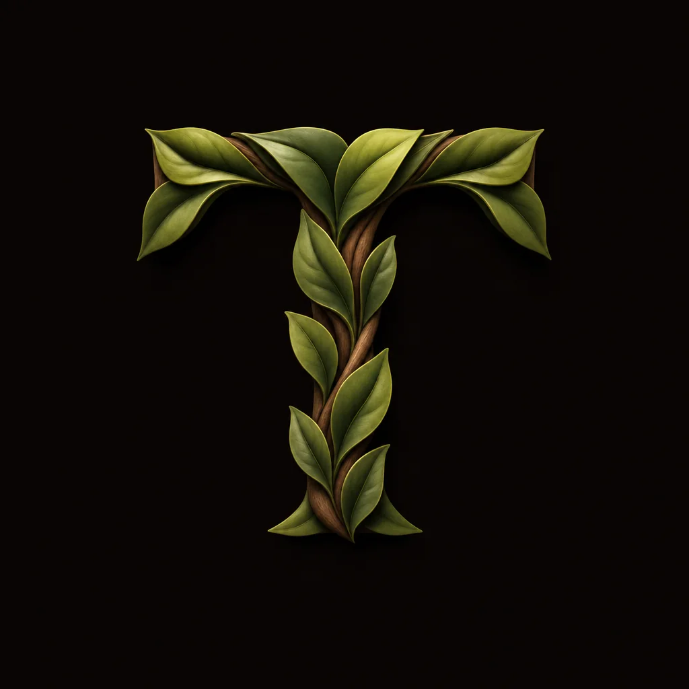
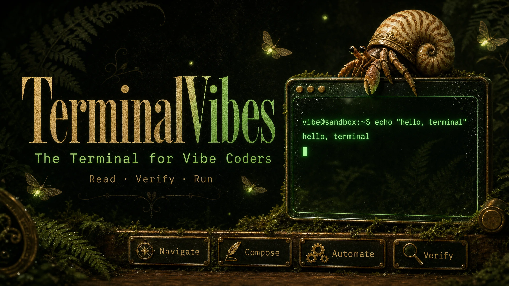
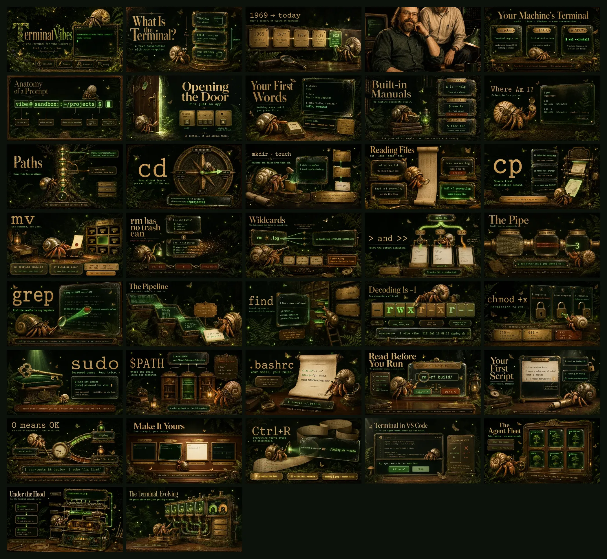
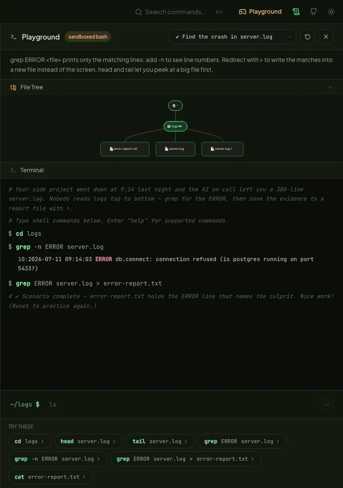
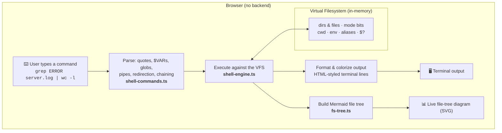

<p align="center">
  
</p>

# TerminalVibes — The Terminal for Vibe Coders

An interactive, visual guide to the bash command line for developers who build with AI-assisted coding tools — and keep getting handed shell commands they can't read yet.

**[Live Site →](https://neovand.github.io/terminalvibes/)**

<p align="center">
  <a href="https://github.com/NeoVand/terminalvibes/releases"></a>
  <a href="https://github.com/NeoVand/terminalvibes/actions/workflows/deploy.yml"></a>
  
  <br />
  
  
  
  
  
  
</p>



## What is this?

TerminalVibes teaches the terminal through the lens of AI-assisted development. Your AI assistant keeps proposing shell commands — this course teaches you to read, verify, and run them with confidence. Instead of dry reference docs, it walks through real scenarios — _"the agent wants to run three commands, one of them is scary"_ — with cozy illustrated section banners, interactive playgrounds, and live diagrams, in a green-forest-and-warm-wood world.

It is the sister project of **[GitVibes](https://github.com/NeoVand/gitvibes)** — Git for Vibe Coders — same pedagogy, same layout, new subject.

Every lesson opens with an original piece of banner art — all **38** of them, in curriculum order:

[](docs/images/banner-poster.webp)

### Curriculum

| Part                             | Topics                                                                                               |
| -------------------------------- | ---------------------------------------------------------------------------------------------------- |
| **Introduction**                 | What the terminal is, a brief history, your machine's terminal (macOS / Linux / WSL), prompt anatomy |
| **1. First Contact**             | Opening the terminal, first commands, getting help (`--help`, `man`, `q` to escape the pager)        |
| **2. Moving Around**             | `pwd` & `ls`, paths, `cd`, making things with `mkdir` & `touch`, reading files                       |
| **3. Copy, Move, Delete**        | `cp`, `mv`, the `rm`-has-no-trash-can safety lesson, wildcards                                       |
| **4. Text & Pipes**              | Redirection, pipes, `grep`, `sort`/`uniq`/`wc`/`cut`, `find`                                         |
| **5. Permissions & Environment** | Reading `ls -l`, `chmod`, `sudo`, `$PATH` & "command not found", shell config & aliases              |
| **6. Terminal for the AI Era**   | Auditing AI-suggested commands, your first script, exit codes & `&&`/`\|\|` chaining                 |
| **7. Your Cockpit**              | Themes & prompts, history superpowers, the VS Code integrated terminal, tabs & splits                |
| **8. Conclusion**                | The command-line mindset, quick reference, the Final Challenge, keep learning                        |

### The playground

A simulated bash sandbox runs entirely in your browser — 15 scenario exercises with completion detection, a live file-tree diagram that redraws after every command, and a prompt that follows your `cwd`:

[](docs/images/playground.webp)

### Features

- **Bash Playground** — a simulated bash sandbox in the browser (a virtual filesystem plus a shell interpreter built for teaching), opened as a sidebar panel from anywhere on the site
- **15 hands-on exercises** with live success detection — a ✔ fires the moment the filesystem reaches the goal state, from first `echo` to a grep-pipeline log hunt, a PATH repair, an agent-command audit, and a messy-home-folder capstone
- **A live file-tree diagram** — the sandbox filesystem drawn as a Mermaid tree after every command: directories, files, your current location, and executables, always in sync with the terminal
- **`share` in every terminal** — serializes your exact session into a link anyone can replay
- **Progress that persists** — sections read, exercises completed, a self-assessed skill checklist, and spaced-repetition refresher nudges (all localStorage; no accounts, no backend)
- **Expandable banners** — click any section illustration to open a full-screen lightbox
- **Vibe prompts** — copy-paste AI prompts for common terminal workflows
- **Search** — `⌘K` / `Ctrl+K` command palette with panic-query aliases ("command not found", "deleted a file", "quit vim")
- **Cheat sheet** — quick command reference from the header, expandable into a full-screen three-column view, downloadable as a typeset PDF
- **Light / dark theme**, installable as a PWA, works offline after one visit
- **Fully static** — no backend; deploys to GitHub Pages

## How the Bash Playground works

The playground is honest about what it is: a **simulated** bash environment, not a real shell — which is exactly what makes it safe to let beginners run `rm -rf` in. A small shell engine keeps an in-memory virtual filesystem (directories, files, permission bits, your cwd, environment variables, aliases, `$?`), and an interpreter parses each command line — quoting, `$VAR` and `~` expansion, globs, pipes, redirection, and `&&`/`||`/`;` chaining — and executes the supported commands with teaching-quality error messages. Commands that make no sense in a sandbox (`sudo`, `nano`, `curl`) are friendly stubs that explain why and point you at what to do instead.



After every command, both the terminal and the file tree update in sync — so you can see the effect of each operation instantly. Scenarios pre-seed the virtual filesystem with files, folders, and logs to set up each lesson.

## Tech stack

| Layer           | Tool                                                  |
| --------------- | ----------------------------------------------------- |
| Framework       | [SvelteKit](https://svelte.dev) (Svelte 5)            |
| Styling         | [Tailwind CSS](https://tailwindcss.com) v4            |
| In-browser bash | Custom simulated shell engine (`src/lib/playground/`) |
| Diagrams        | [Mermaid.js](https://mermaid.js.org)                  |
| Icons           | [Lucide](https://lucide.dev)                          |
| Testing         | [Playwright](https://playwright.dev)                  |
| Hosting         | GitHub Pages (`@sveltejs/adapter-static`)             |

## Getting started

```bash
git clone https://github.com/NeoVand/terminalvibes.git
cd terminalvibes
npm install
npm run dev
```

Open [http://localhost:5173](http://localhost:5173).

## Scripts

| Command           | Description                        |
| ----------------- | ---------------------------------- |
| `npm run dev`     | Start dev server                   |
| `npm run build`   | Production build → `build/`        |
| `npm run preview` | Preview production build           |
| `npm run check`   | Type-check                         |
| `npm run lint`    | Prettier + ESLint                  |
| `npm run test`    | Vitest unit + Playwright e2e tests |

## Assets

Section banner images live in `static/images/` (kebab-case filenames). Image generation prompts for creating or updating the illustrations are in [`docs/IMAGE_PROMPTS.md`](docs/IMAGE_PROMPTS.md). Drop new art in as PNG and run `node scripts/optimize-images.mjs` to convert it to WebP, then `node scripts/make-poster.mjs` to refresh the banner poster above (it reads the curriculum order straight from the section components). `node scripts/make-playground-shot.mjs <baseUrl>` regenerates the playground screenshot against a running dev server, and `node scripts/make-placeholders.mjs` fills any missing banners with placeholder art. One image is a real photograph rather than generated art: `static/images/thompson-ritchie.jpg` (Ken Thompson and Dennis Ritchie, public domain).

The downloadable cheat sheet PDF is rendered from the unlisted `/cheatsheet-print` route — after editing `src/lib/data/cheat-sheet.ts`, regenerate it with `node scripts/make-cheatsheet-pdf.mjs` (dev server running).

## Deployment

Pushes to `main` deploy automatically to GitHub Pages via [`.github/workflows/deploy.yml`](.github/workflows/deploy.yml).

## License

MIT
