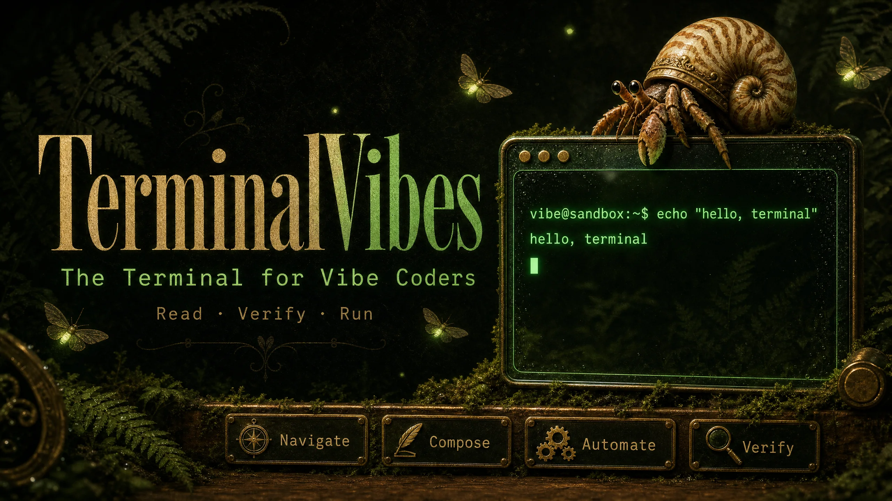
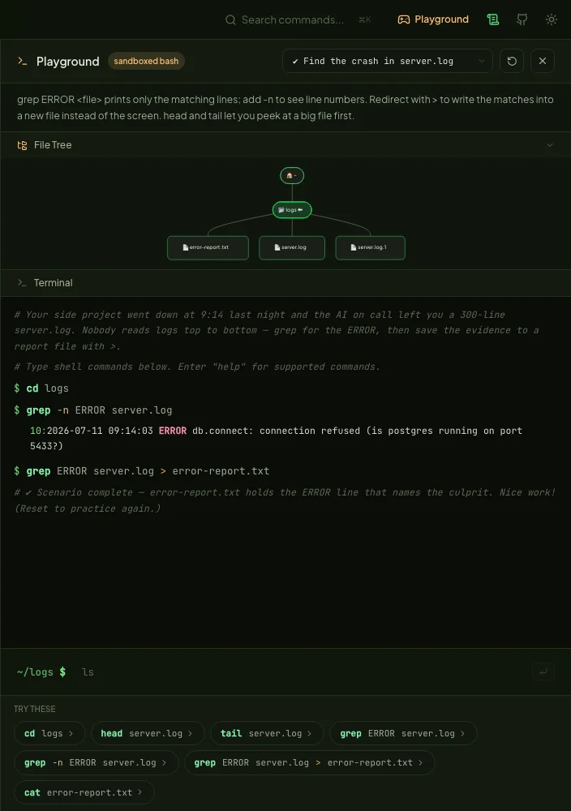
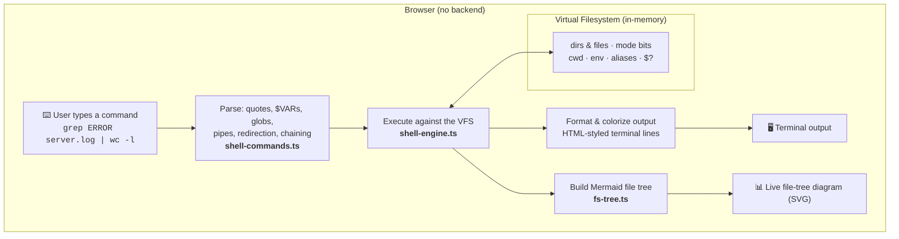

<p align="center">
  
</p>

# TerminalVibes — Learn the terminal by doing

An illustrated, interactive terminal course for absolute beginners. Type a first command immediately, learn to fix a line with the keyboard, then build useful skills one small task at a time.

**[Live Site →](https://neovand.github.io/terminalvibes/)**

<p align="center">
  <a href="https://github.com/NeoVand/terminalvibes/releases"></a>
  <a href="https://github.com/NeoVand/terminalvibes/actions/workflows/deploy.yml"></a>
  
  <br />
  
  
  
  
  
  
</p>



## What is this?

The first screen is a working practice terminal: say hello, change the message, make a typo, repair it, and cancel an unfinished command. A keyboard workshop follows immediately. Definitions and history are available when a learner wants them.

The fourteen chapters build from finding a garden note and editing a notebook to search pipelines, scripts, processes, networks, useful tools, and checking an agent’s proposals. Examples separate what you type from what the terminal prints. Native Bash and zsh differences and the simulator’s limits are called out where they matter.

It is the sister project of **[GitVibes](https://github.com/NeoVand/gitvibes)**.

Illustrations are being renewed after the content revision. Existing artwork stays in the course until the owner selects replacements from at least five generated alternatives per concept; the two `*-v2` workbench assets are unselected drafts.

### Curriculum

| Part                            | Topics                                                                                                     |
| ------------------------------- | ---------------------------------------------------------------------------------------------------------- |
| **Introduction**                | Immediate hello, repair a typo, cancel, keyboard workshop; optional terminology and history                |
| **1. First Contact**            | Opening the terminal, first commands, getting help (`--help`, `man`, `q` to escape the pager)              |
| **2. Moving Around**            | `pwd` & `ls`, paths, `cd`, making a notebook with `mkdir` & `touch`, opening/editing/saving/checking files |
| **3. Copy, Move, Delete**       | `cp`, `mv`, the `rm`-has-no-trash-can safety lesson, wildcards                                             |
| **4. Text & Pipes**             | Redirection, pipes, `grep`, `sort`/`uniq`/`wc`/`cut`, `find`                                               |
| **5. Permissions & Config**     | Reading `ls -l`, `chmod`, `sudo`, `$PATH` & "command not found", shell config & aliases                    |
| **6. Scripts & Automation**     | Your first script (shebang, `chmod +x`, `$1`), exit codes & `&&`/`\|\|` chaining                           |
| **7. Text Surgery**             | `sed` find & replace, line surgery with `d`/`p`, the `-i.bak` house rule, columns with `awk`               |
| **8. Processes & Ports**        | `ps`/`pgrep`, `kill` vs `kill -9`, freeing port 3000 with `lsof`, background jobs (`&`, `fg`)              |
| **9. Talking to the Network**   | `localhost` & URLs, `curl`, reading JSON with `jq`, API keys in `.env`, `ssh`                              |
| **10. The Toolshed**            | Package managers, `tar`/`zip` decoded, symlinks, disk usage, `rg`, `fd`, `fzf`, `bat`, and `zoxide`        |
| **11. Terminal for the AI Era** | The four-step audit, red flags (`rm -rf`, `sed -i`, `kill -9`, `curl \| bash`), prompt injection           |
| **12. Your Cockpit**            | Themes & prompts, history superpowers, the VS Code integrated terminal, tabs, splits, and `tmux`           |
| **13. Under the Hood**          | terminal/shell/program layers, signals, conditions, loops, careful Bash scripts, ShellCheck                |
| **14. Conclusion**              | The command-line mindset, quick reference, two final challenges, keep learning                             |

### The playground

A simulated bash sandbox runs entirely in your browser — 36 scenario exercises with completion detection, a live file-tree diagram that redraws after every command, and a prompt that follows your `cwd`:

[](docs/images/playground.webp)

### Features

- **Bash Playground** — a simulated bash sandbox in the browser (a virtual filesystem plus a shell interpreter built for teaching), opened as a sidebar panel from anywhere on the site
- **36 hands-on exercises** with live success detection — a ✔ fires the moment the filesystem reaches the goal state, from first `echo` to a grep-pipeline log hunt, a PATH repair, an agent-command audit, and a messy-home-folder capstone
- **A live file-tree diagram** — the sandbox filesystem drawn as a Mermaid tree after every command: directories, files, your current location, and executables, always in sync with the terminal
- **Command-session sharing** — command-only sessions can be replayed from a link. Sessions containing editor saves explain that those edits are not yet shareable.
- **Progress that persists** — sections read, exercises completed, a self-assessed skill checklist, and spaced-repetition refresher nudges (all localStorage; no accounts, no backend)
- **Expandable banners** — click any section illustration to open a full-screen lightbox
- **Vibe prompts** — copy-paste AI prompts for common terminal workflows
- **Practice file editor** — open or create a file, save, close, and verify it with `cat`; protects unsaved drafts and supports undo/redo
- **Keyboard practice** — Ctrl+A/E/K/U/W/Y/C, word movement, recall, and completion, with browser-reserved shortcuts clearly identified
- **Search** — `⌘K` / `Ctrl+K` command palette with panic-query aliases ("command not found", "deleted a file", "quit vim")
- **Cheat sheet** — intent search (such as “delete a whole line”), references focused on the current exercise, editable placeholders before copying, and a downloadable PDF
- **Light / dark theme**, installable as a PWA, works offline after one visit
- **Fully static** — no backend; deploys to GitHub Pages

## How the Bash Playground works

The playground is honest about what it is: a **simulated** bash environment, not a real shell — which is exactly what makes it safe to let beginners run `rm -rf` in. A small shell engine keeps an in-memory virtual filesystem (directories, files, permission bits, your cwd, environment variables, aliases, `$?`), and an interpreter parses each command line — quoting, `$VAR` and `~` expansion, globs, pipes, redirection, and `&&`/`||`/`;` chaining — and executes the supported commands with teaching-quality error messages. It also models a **process table** (so `ps`, `kill`, `lsof` and background jobs behave, and a port can genuinely be "already in use") and a **virtual network** — `curl localhost:3000` is answered by whatever process is actually holding that port, so killing a server really does break the health check. Commands that make no sense in a sandbox (`sudo`, `nano`, `ssh`) are friendly stubs that explain why and point you at what to do instead.


```mermaid
flowchart TD
    subgraph Browser["Browser (no backend)"]
        Input["⌨️ User types a command\n<code>grep ERROR server.log | wc -l</code>"]
        Parse["Parse: quotes, $VARs, globs,\npipes, redirection, chaining\n<b>shell-commands.ts</b>"]
        Engine["Execute against the VFS\n<b>shell-engine.ts</b>"]

        subgraph VFS["Virtual Filesystem (in-memory)"]
            FS["dirs & files · mode bits\ncwd · env · aliases · $?"]
        end

        Output["Format & colorize output\nHTML-styled terminal lines"]
        Tree["Build Mermaid file tree\n<b>fs-tree.ts</b>"]
        Terminal["🖥️ Terminal output"]
        Diagram["📊 Live file-tree diagram (SVG)"]
    end

    Input --> Parse
    Parse --> Engine
    Engine <--> FS
    Engine --> Output
    Engine --> Tree
    Output --> Terminal
    Tree --> Diagram
```

After every command, both the terminal and the file tree update in sync — so you can see the effect of each operation instantly. Scenarios pre-seed the virtual filesystem with files, folders, and logs to set up each lesson.

## The tutor: scripted, local, or your provider

The default is a clearly labeled scripted guide. A learner can download a local model, or connect their own **OpenAI or Anthropic API key** and choose a catalog model or enter an exact API model ID. Connecting does not make a paid request; asking a question does. The key stays in memory for the current page session, is sent only to the selected provider’s fixed API endpoint, and is cleared on disconnect/reload. There is no application server or proxy, and no maintainer key is included in the build.

Cloud requests send the conversation, relevant course excerpts, and optionally the learner’s recent practice command/output. The sharing toggle and preview make this visible. Provider usage may cost money; ChatGPT/Claude app subscriptions are separate from API billing. No cloud requests run in the background. Account access and provider browser support still determine whether a selected model works.

The catalog is checked monthly against official provider documentation by a GitHub Actions workflow that opens a reviewable PR. It needs no provider secrets and never auto-merges. See [model catalog maintenance](docs/MODEL_CATALOG.md).

Both model modes use course retrieval and can propose demonstrations in a separate simulated terminal. Every proposed command passes through the learner’s approval gate. The tutor distinguishes that demonstration from the learner’s own exercise.

### Optional local models

| Model                                                                                         | Size (q4f16) | Weights license                                                                                      |
| --------------------------------------------------------------------------------------------- | ------------ | ---------------------------------------------------------------------------------------------------- |
| [LFM2.5-1.2B-Instruct](https://huggingface.co/LiquidAI/LFM2.5-1.2B-Instruct-ONNX) _(default)_ | ~760 MB      | [LFM Open License v1.0](https://huggingface.co/LiquidAI/LFM2.5-1.2B-Instruct-ONNX/blob/main/LICENSE) |
| [Qwen3.5-2B](https://huggingface.co/onnx-community/Qwen3.5-2B-ONNX)                           | ~1.3 GB      | Apache 2.0                                                                                           |

Local weights download once (explicit click, size disclosed) and persist in browser Cache Storage. Without a downloaded model the Agent runs as a scripted guide over the course index.

## Tech stack

| Layer           | Tool                                                  |
| --------------- | ----------------------------------------------------- |
| Framework       | [SvelteKit](https://svelte.dev) (Svelte 5)            |
| Styling         | [Tailwind CSS](https://tailwindcss.com) v4            |
| In-browser bash | Custom simulated shell engine (`src/lib/playground/`) |
| Diagrams        | [Mermaid.js](https://mermaid.js.org)                  |
| Icons           | [Lucide](https://lucide.dev)                          |
| Testing         | [Playwright](https://playwright.dev)                  |
| Hosting         | GitHub Pages (`@sveltejs/adapter-static`)             |

## Getting started

```bash
git clone https://github.com/NeoVand/terminalvibes.git
cd terminalvibes
npm install
npm run dev
```

Open [http://localhost:5173](http://localhost:5173).

## Scripts

| Command           | Description                        |
| ----------------- | ---------------------------------- |
| `npm run dev`     | Start dev server                   |
| `npm run build`   | Production build → `build/`        |
| `npm run preview` | Preview production build           |
| `npm run check`   | Type-check                         |
| `npm run lint`    | Prettier + ESLint                  |
| `npm run test`    | Vitest unit + Playwright e2e tests |

## Assets

Section banners live in `static/images/`. The current illustration inventory and five alternatives per concept are defined in `src/lib/data/art-concepts.json`. Run `node scripts/art-inventory.mjs --check` to check coverage and `node scripts/art-inventory.mjs --prompt CONCEPT_ID 01` to read an individual generation brief. Older prompt documents remain as history, not instructions to replace selected assets.

Unapproved generated images belong in the ignored `static/art-candidates/` directory. The development-only `/art-review` gallery supports comparison and explicit owner selection. The production adapter and service worker exclude these drafts, including when building locally. Import one actual generated image with `node scripts/add-art-candidate.mjs CONCEPT_ID 01 /absolute/generated.png /absolute/actual-prompt.txt`, then refresh the local index with `node scripts/art-inventory.mjs --availability`. Importing preserves the full frame and never selects a candidate.

Only selected artwork should replace course assets. Rebuild responsive derivatives and timeline thumbnails after approval. The existing historical photograph, `static/images/thompson-ritchie.jpg`, is documentary material rather than a generated illustration.

The downloadable cheat sheet PDF is rendered from the unlisted `/cheatsheet-print` route — after editing `src/lib/data/cheat-sheet.ts`, regenerate it with `node scripts/make-cheatsheet-pdf.mjs` (dev server running).

## Deployment

Pushes to `main` deploy automatically to GitHub Pages via [`.github/workflows/deploy.yml`](.github/workflows/deploy.yml).

## License

MIT
